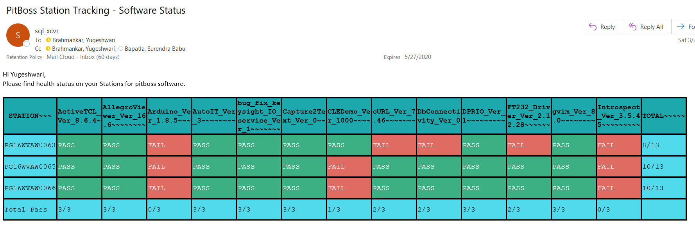

# HTML-table-in-Email
## Description:

This Python script is used to send customized HTML table to users which tracks installed software status. It queries database and stored procedure to get the required data.

## Python libraries used:

smtplib --> to connect with SMTP mail server 
MIMEText, MIMEMultipart --> to create text of mail body 
pyodbc --> to connect with database 

## Mail output will look like:

